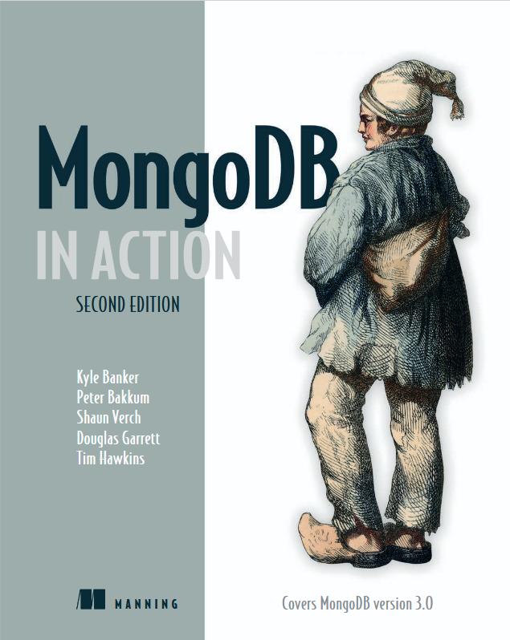

# MongoDB-IN-ACTION

This repository contains exercises, code snippets, and solutions based on the book **"MongoDB in Action"**.

  

### Key Topics:
- [ ] Basic CRUD Operations
- [ ] Data Modeling
- [ ] Advanced Queries & Aggregation Framework
- [ ] Indexing & Performance Optimization

---
*This repository serves as a personal collection of practice exercises and learning notes for MongoDB.*
